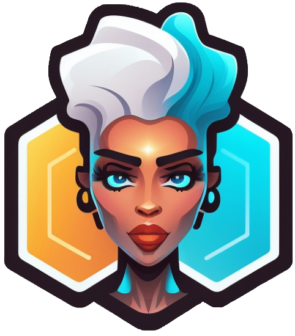

<h1 align="center">
  
   BotForge 
</h1>

BotForge is an unofficial OpenAI Chat API's Android client that allows you to create and share personas (prompts for the Chat API) with other users. You can also chat with different personas and have fun conversations.

## Features

- Uses Google Material Design 3 and Jetpack Compose for a modern and beautiful UI
- Completely supports Android 12's Dynamic Theming and adapts to your wallpaper colors
- Built using Kotlin, a concise and powerful programming language for Android development
- Uses Firebase's Realtime Database and Firestore to store personas, and allows users to upvote and downvote personas
- Uses both Shared Preferences and DataStore to store user preferences and settings
- Has a Light, Dark and Auto mode for different lighting conditions
- Uses Room Database to locally store user's personas and offline access with full text search of community personas

## Installation

To install BotForge, you can either download it from the Google Play Store or clone this repository and import it into Android Studio.

## Screenshots

|  |  |  |
|--------------------------------------------------------------|--------------------------------------------------------------|--------------------------------------------------------------|
|  |  |  |

## Usage

To use BotForge, you need to have an OpenAI account and an API key. You can sign up for OpenAI and get your API key [here](https://platform.openai.com/account/api-keys).

Once you have your API key, you can enter it in the app settings and start creating and chatting with personas. You can also browse the community shared personas and upvote or downvote them. You can also edit or delete your own personas.

## Tech Stack

- **Kotlin**: A modern and concise programming language for Android development.
- **Jetpack Compose**: A declarative UI toolkit for building native Android apps with less code and more expressive UIs.
- **Firebase**: A platform that provides various services for app development, such as authentication, database, storage, analytics, etc.
- **Room Database**: An abstraction layer over SQLite that allows easy access and manipulation of local data.
- **LiveData and ViewModel**: Architecture components that help manage app data and UI state in a lifecycle-aware way.
- **Dagger-Hilt**: A dependency injection library that simplifies the use of Dagger in Android apps.
- **Coroutines and Flows**: Kotlin features that enable asynchronous and reactive programming with less boilerplate and more efficiency.
- **Material Design 3**: A design system that provides guidelines and components for creating beautiful and consistent Android apps.
- **Dynamic Theming**: A feature of Android 12 that allows apps to adapt their color scheme to the system theme and wallpaper.
- **Markdown Rendering**: A feature that allows displaying formatted text using a simple syntax, such as tables, lists, headings, etc. using [Compose Markdown](https://github.com/jeziellago/compose-markdown)
